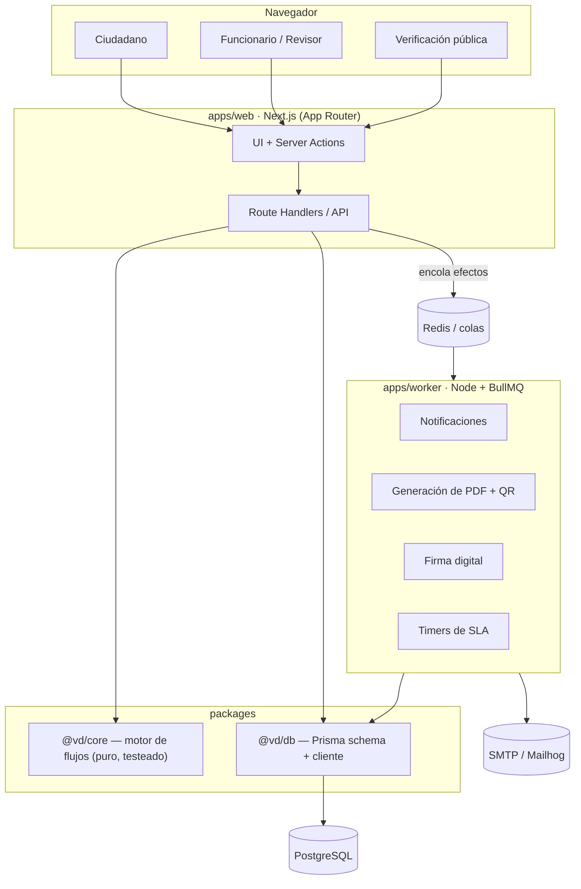
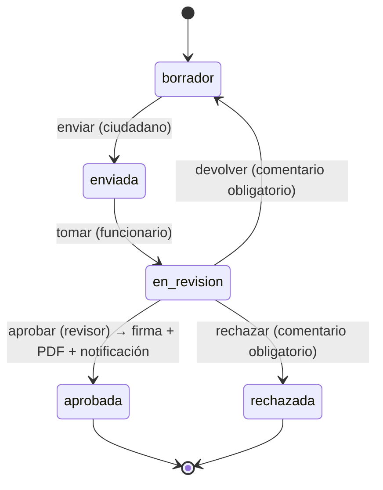

# Ventanilla Digital

> Plataforma GovTech para la gestión de trámites institucionales: catálogo de
> trámites con formularios dinámicos, **motor de flujos configurable**, firma
> digital de los actos aprobados y **portal público de verificación** por QR.

[](https://github.com/emanuel070801/ventanilla-digital/actions/workflows/ci.yml)
&nbsp;·&nbsp; TypeScript · Next.js · NestJS-style layering · PostgreSQL · Redis · Prisma · Turborepo

---

## El problema

En una institución pública un mismo trámite (una constancia, un permiso, una
licencia) pasa por varias manos: se recibe en ventanilla, lo revisa un
funcionario, lo aprueba un jefe, se notifica al ciudadano y se emite un
documento firmado. Hoy eso vive en papel, correos y hojas de cálculo. No hay
trazabilidad, no hay tiempos, y verificar si un documento es auténtico es
imposible.

**Ventanilla Digital** modela ese proceso como dato: cada trámite define su
formulario (JSON Schema) y su flujo (una máquina de estados con roles y SLA),
de modo que un administrador institucional publica un trámite nuevo **sin
desplegar código**.

## Características

- **Multi-institución (multi-tenant).** Instituciones, dependencias y usuarios con roles por institución.
- **Catálogo de trámites.** Cada trámite = formulario dinámico + definición de flujo, versionados.
- **Motor de flujos (`@vd/core`).** Máquina de estados pura y testeada: transiciones con roles autorizados, comentarios obligatorios, guards de negocio, SLA por estado y **efectos declarativos** (`notify`, `sign`, `generate_pdf`, `webhook`).
- **Bandeja del funcionario.** Tomar, aprobar, rechazar o devolver solicitudes con historial inmutable.
- **Firma digital.** Al aprobar, el acto se firma (RSA-SHA256) y se emite un PDF con QR.
- **Portal público de verificación.** Cualquiera escanea el QR y confirma validez, sin autenticarse.
- **Auditoría append-only.** Toda acción del sistema queda registrada.
- **Notificaciones.** In-app y correo (Mailhog en desarrollo).
- **Tableros de gestión.** Trámites por estado, tiempos promedio, SLA vencidos.

## Arquitectura

Monorepo Turborepo. El dominio (`@vd/core`) no conoce base de datos ni HTTP: es
una máquina de estados pura que devuelve **qué efectos ejecutar**; la capa de
aplicación y los workers los materializan.



### Ciclo de vida de una solicitud



Ese diagrama **es** la `WorkflowDefinition` que vive en la base de datos
(`packages/core/src/samples.ts`). Cambiarlo no requiere recompilar.

## Modelo de dominio

15 entidades en 6 bloques ([`schema.prisma`](packages/db/prisma/schema.prisma)):

| Bloque           | Entidades                                                       |
| ---------------- | --------------------------------------------------------------- |
| Organización     | `Institution`, `Department`                                     |
| Identidad y RBAC | `User`, `Membership`, `Account`, `Session`, `VerificationToken` |
| Catálogo         | `ProcedureType`                                                 |
| Solicitudes      | `Request`, `RequestDocument`, `WorkflowTransitionLog`           |
| Firma            | `Signature`                                                     |
| Observabilidad   | `AuditLog`, `Notification`                                      |

## Stack

| Capa             | Tecnología                                                         |
| ---------------- | ------------------------------------------------------------------ |
| Frontend + BFF   | Next.js 15 (App Router, Server Actions), React 19, Tailwind        |
| Dominio          | TypeScript puro (`@vd/core`), sin dependencias                     |
| Datos            | PostgreSQL 16 + Prisma 6                                           |
| Colas / trabajos | Redis + BullMQ (`apps/worker`)                                     |
| Auth             | Auth.js (credenciales + RBAC por membresía)                        |
| Infra local      | Docker Compose (Postgres, Redis, Mailhog)                          |
| Tooling          | Turborepo, pnpm workspaces, Prettier, `node:test`                  |
| CI               | GitHub Actions (lint · typecheck · test · `docker compose config`) |

## Estructura

```
ventanilla-digital/
├── apps/
│   ├── web/        # Next.js — UI, API, portal de verificación   (en construcción)
│   └── worker/     # Consumidores BullMQ: firma, PDF, correo, SLA (en construcción)
├── packages/
│   ├── core/       # Motor de flujos — máquina de estados pura + 13 tests
│   └── db/         # Prisma schema, cliente singleton, seed, hash de contraseñas
├── docker-compose.yml
└── turbo.json
```

## Puesta en marcha

**Requisitos:** Node ≥ 20, pnpm 11, Docker.

```bash
pnpm install
cp .env.example .env

pnpm infra:up          # Postgres + Redis + Mailhog
pnpm build             # genera el cliente Prisma y compila los paquetes
pnpm --filter @vd/db migrate    # crea el esquema
pnpm db:seed           # institución, usuarios y 3 solicitudes de ejemplo

pnpm test              # corre las pruebas del motor de flujos
```

Usuarios del seed (contraseña `Password123!`): `super@`, `admin@alcaldia-demo.local`,
`funcionario@alcaldia-demo.local`, `revisor@alcaldia-demo.local`, `ana@correo.local`,
`luis@correo.local`.

## Roadmap

- [x] Motor de flujos `@vd/core` con validación de definiciones y pruebas
- [x] Modelo de datos completo (Prisma) + seed realista
- [x] Infra local (Docker Compose) y CI
- [ ] `apps/web`: autenticación + RBAC (Auth.js)
- [ ] `apps/web`: catálogo de trámites y formulario dinámico desde JSON Schema
- [ ] `apps/web`: creación y seguimiento de solicitudes (ciudadano)
- [ ] `apps/web`: bandeja del funcionario (tomar / aprobar / rechazar / devolver)
- [ ] `apps/worker`: efectos `notify` y `generate_pdf` (PDF + QR)
- [ ] Firma digital real y portal público de verificación
- [ ] Timers de SLA y tablero de gestión
- [ ] Documentación OpenAPI de la API pública
- [ ] Despliegue de demo (Vercel + Neon + Upstash)

## Licencia

[MIT](LICENSE)
