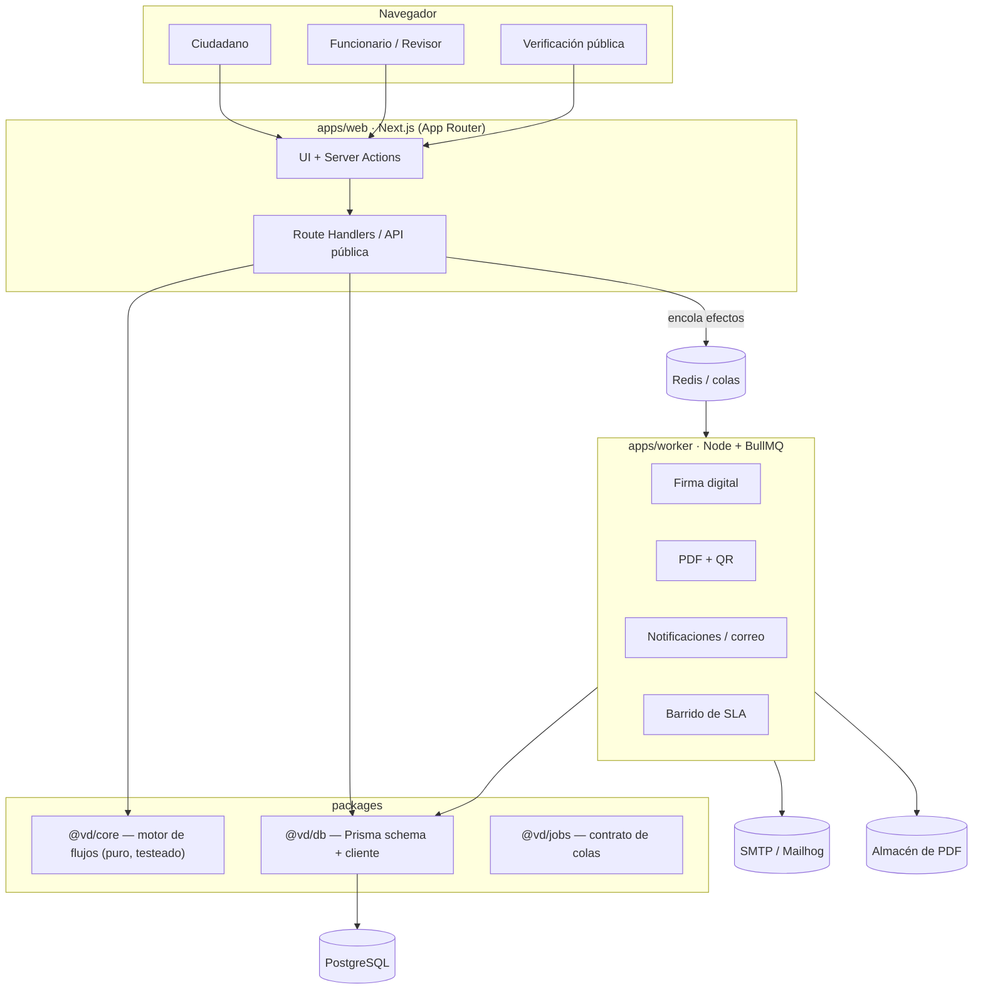
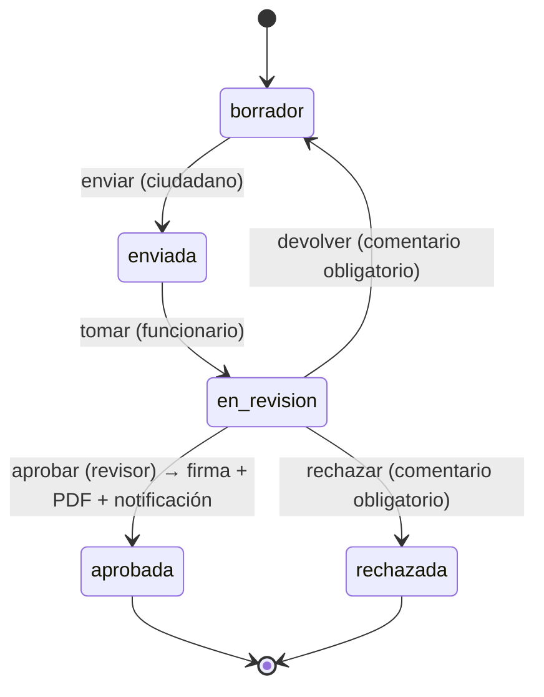

# Ventanilla Digital

> Plataforma GovTech para la gestión de trámites institucionales: catálogo de
> trámites con formularios dinámicos, **motor de flujos configurable**, firma
> digital de los actos aprobados y **portal público de verificación** por QR.

[](https://github.com/emanuel070801/ventanilla-digital/actions/workflows/ci.yml)
&nbsp;·&nbsp; TypeScript · Next.js 15 · React 19 · PostgreSQL · Prisma · Redis · BullMQ · Auth.js

---

## El problema

En una institución pública un mismo trámite (una constancia, un permiso, una
licencia) pasa por varias manos: se recibe en ventanilla, lo revisa un
funcionario, lo aprueba un jefe, se notifica al ciudadano y se emite un
documento firmado. Hoy eso vive en papel, correos y hojas de cálculo. No hay
trazabilidad, no hay tiempos, y verificar si un documento es auténtico es
imposible.

**Ventanilla Digital** modela ese proceso como dato: cada trámite define su
formulario (JSON Schema) y su flujo (una máquina de estados con roles y SLA),
de modo que un administrador institucional publica un trámite nuevo **sin
desplegar código**.

## Características

- **Multi-institución (multi-tenant).** Instituciones, dependencias y usuarios con roles por institución (RBAC por membresía).
- **Catálogo de trámites.** Cada trámite = formulario dinámico (JSON Schema) + definición de flujo, versionados.
- **Formularios dinámicos.** El formulario del ciudadano se genera desde el JSON Schema y se valida en el servidor con Ajv.
- **Motor de flujos (`@vd/core`).** Máquina de estados pura y testeada: transiciones con roles autorizados, comentarios obligatorios, guards de negocio, SLA por estado y **efectos declarativos** (`notify`, `sign`, `generate_pdf`, `webhook`).
- **Bandeja del funcionario.** Tomar, aprobar, rechazar o devolver solicitudes; historial inmutable con autor, fecha y comentario.
- **Firma digital.** Al aprobar, el acto se firma (RSA-SHA256) y un worker genera un PDF con código QR de verificación.
- **Portal público de verificación.** Cualquiera valida un documento con su código, sin autenticarse — web y API JSON.
- **SLA.** Fecha límite por estado; un barrido periódico marca los vencidos y notifica.
- **Auditoría append-only.** Toda acción del sistema queda registrada.
- **Notificaciones.** In-app y correo (Mailhog en desarrollo).
- **Panel de gestión.** Solicitudes por estado, en proceso, SLA vencido y tiempo medio de resolución.

## Arquitectura

Monorepo pnpm workspaces. El dominio (`@vd/core`) no conoce base de datos ni
HTTP: es una máquina de estados pura que devuelve **qué efectos ejecutar**; la
capa de aplicación (`apps/web`) los persiste y encola, y `apps/worker` los
materializa (firmar, generar PDF, enviar correo, barrer SLA).



### Ciclo de vida de una solicitud



Ese diagrama **es** la `WorkflowDefinition` que vive en la base de datos
(`packages/core/src/samples.ts`). Cambiarlo no requiere recompilar.

## Modelo de dominio

15 entidades en 6 bloques ([`schema.prisma`](packages/db/prisma/schema.prisma)):

| Bloque           | Entidades                                                       |
| ---------------- | --------------------------------------------------------------- |
| Organización     | `Institution`, `Department`                                     |
| Identidad y RBAC | `User`, `Membership`, `Account`, `Session`, `VerificationToken` |
| Catálogo         | `ProcedureType`                                                 |
| Solicitudes      | `Request`, `RequestDocument`, `WorkflowTransitionLog`           |
| Firma            | `Signature`                                                     |
| Observabilidad   | `AuditLog`, `Notification`                                      |

## Stack

| Capa             | Tecnología                                                         |
| ---------------- | ---------------------------------------------------------------- |
| Frontend + BFF   | Next.js 15 (App Router, Server Actions), React 19, Tailwind 4    |
| Dominio          | TypeScript puro (`@vd/core`), sin dependencias                  |
| Datos            | PostgreSQL 16 + Prisma 6                                         |
| Colas / trabajos | Redis + BullMQ (`apps/worker`)                                   |
| Auth             | Auth.js (credenciales, JWT, RBAC por membresía)                 |
| Validación       | Ajv (JSON Schema en la frontera de confianza)                   |
| Documentos       | pdfkit + qrcode; almacén local (driver S3 pendiente)            |
| Infra local      | Docker Compose (Postgres, Redis, Mailhog)                       |
| Tooling          | pnpm workspaces, Prettier, `node:test`                          |
| CI               | GitHub Actions (build · lint · typecheck · test · compose config) |

## Estructura

```
ventanilla-digital/
├── apps/
│   ├── web/        # Next.js — UI, Server Actions, API pública, portal de verificación
│   └── worker/     # Consumidores BullMQ: firma, PDF+QR, correo, barrido de SLA
├── packages/
│   ├── core/       # Motor de flujos — máquina de estados pura (16 tests)
│   ├── db/         # Prisma schema, cliente singleton, seed, hash de contraseñas (scrypt)
│   └── jobs/       # Contrato de colas compartido (nombres, tipos, conexión Redis)
├── docker-compose.yml
└── .github/workflows/ci.yml
```

## Puesta en marcha

**Requisitos:** Node ≥ 20, pnpm 11, Docker.

```bash
pnpm install
cp .env.example .env

pnpm infra:up                    # Postgres + Redis + Mailhog
pnpm build                       # cliente Prisma + compilación de paquetes
pnpm --filter @vd/db migrate     # crea el esquema
pnpm db:seed                     # institución, usuarios y 3 solicitudes de ejemplo

pnpm dev                         # web en :3000  +  worker
```

`pnpm test` corre las pruebas (`@vd/core`, `@vd/worker`). Correo de prueba en
<http://localhost:8025> (Mailhog).

### Cuentas de demostración

Contraseña `Password123!`:

| Correo                            | Rol                  |
| --------------------------------- | -------------------- |
| `revisor@alcaldia-demo.local`     | revisor (aprueba)    |
| `funcionario@alcaldia-demo.local` | funcionario (bandeja)|
| `ana@correo.local`                | ciudadana            |

### Probar el flujo completo

1. Entra como `ana@correo.local` → **Trámites → Constancia laboral** → completa y envía.
2. Entra como `funcionario@…` → **Solicitudes** (bandeja) → **Tomar caso**.
3. Entra como `revisor@…` → abre la solicitud → **Aprobar**.
4. El worker firma, genera el PDF y notifica. En el detalle aparece **Descargar PDF** y el código de verificación.
5. Abre `/verificar`, pega el código → **Documento auténtico**.

## API pública

Verificación sin autenticación. Especificación en [`openapi.yaml`](openapi.yaml).

```
GET /api/verificar/VD-1A2B-3C4D-5E6F
→ 200 { "valid": true, "solicitud": "VD-2026-…", "procedimiento": "Constancia laboral",
        "institucion": "…", "emitidoEl": "…", "algoritmo": "RSA-SHA256", "hash": "…" }
→ 404 { "valid": false }
```

## Roadmap

- [x] Motor de flujos `@vd/core` con validación de definiciones y pruebas
- [x] Modelo de datos completo (Prisma) + seed realista
- [x] Infra local (Docker Compose) y CI
- [x] `apps/web`: autenticación + RBAC (Auth.js)
- [x] `apps/web`: catálogo de trámites y formulario dinámico desde JSON Schema
- [x] `apps/web`: creación y seguimiento de solicitudes (ciudadano)
- [x] `apps/web`: bandeja del funcionario (tomar / aprobar / rechazar / devolver)
- [x] `apps/worker`: efectos `notify`, `sign` y `generate_pdf` (PDF + QR)
- [x] Firma digital y portal público de verificación (web + API)
- [x] Barrido de SLA y panel de gestión
- [x] Documentación OpenAPI de la API pública
- [ ] Migración `prisma migrate` versionada en el repo (hoy `db push` / `migrate dev`)
- [ ] Adjuntar documentos a la solicitud (`RequestDocument` + almacenamiento)
- [ ] Driver de almacenamiento S3
- [ ] Pruebas end-to-end (Playwright)
- [ ] Despliegue de demo (Vercel + Neon + Upstash)

## Licencia

[MIT](LICENSE)
